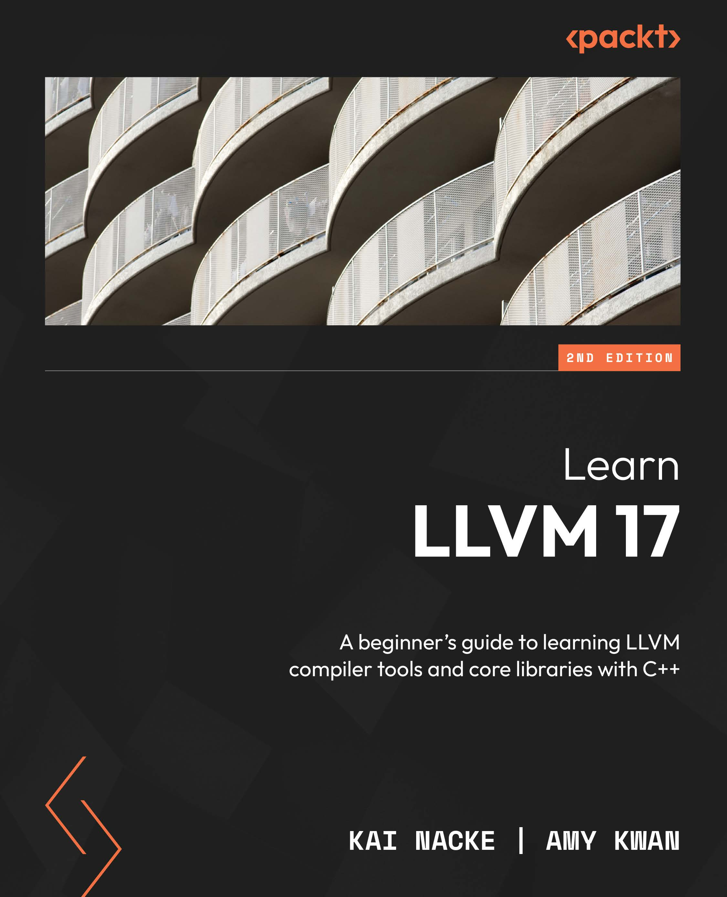

# Learn LLVM 17
A beginner's guide to learning LLVM compiler tools and core libraries with C++ 

(*使用C++学习LLVM编译器和核心库的初学者教程*)

 

* 作者：Kai Nacke 和 Amy Kwan

* 译者：陈晓伟

* 原文发布时间：2024年1月

> 翻译是译者用自己的思想，换一种语言，对原作者想法的重新阐释。鉴于我的学识所限，误解和错译在所难免。如果你能买到本书的原版，且有能力阅读英文，请直接去读原文。因为与之相较，我的译文可能根本不值得一读。
>
> 
 — 云风，程序员修炼之道第2版译者

## 本书概述

构造编译器是一项复杂而迷人的任务。LLVM项目为编译器提供了可重用的组件，LLVM核心库实现了世界级的优化代码生成器，可以为所有主流CPU架构翻译与源语言无关的机器码中间表示，许多编程语言的编译器已经在使用LLVM。

本书将介绍如何实现自己的编译器，以及如何使用LLVM来实现。您将了解编译器的前端如何将源代码转换为抽象语法树，以及如何从中生成中间表示(IR)。此外，还将探索在编译器中添加一个优化管道，可将IR编译为高性能的机器码。

LLVM框架可以通过多种方式进行扩展，读者将了解如何向LLVM添加通道，甚至是一个全新的后端。高级主题，如编译不同的CPU架构和扩展clang和clang静态分析器与自己的插件和检查器也包括在内。本书遵循一种实用的方法，并附有示例源代码，读者可以在自己的项目中应用相应的代码。

## 作者简介

**Kai Nacke**是一名专业IT架构师，目前居住在加拿大多伦多。毕业于德国多特蒙德技术大学的计算机科学专业。他关于通用哈希函数的毕业论文，被评为最佳论文。

他在IT行业工作超过20年，在业务和企业应用程序的开发和架构方面有丰富的经验。他在研发一个基于LLVM/Clang的编译器。

几年来，他一直是LDC(基于LLVM的D语言编译器)的维护者。在Packt出版过《D Web Development》一书，他也曾在自由和开源软件开发者欧洲会议(FOSDEM)的LLVM开发者室做过演讲。

## 本书相关

* github翻译地址：https://github.com/xiaoweiChen/Learn-LLVM-17

* 译文的LaTeX 环境配置：https://www.cnblogs.com/1625--H/p/11524968.html

  * 禁用拼写检查：https://blog.csdn.net/weixin_39278265/article/details/87931348

  * 使用xelatex编译时需要添加`-shell-escape`和`-8bit`选项，例如：

    `xelatex -synctex=1 -interaction=nonstopmode -shell-escape -8bit "C++-Standard-Library".tex`

  * 为了内容中表格和目录索引能正常生成，需要至少两次连续编译

* vscode中配置LaTeX：https://blog.csdn.net/Ruins_LEE/article/details/123555016

